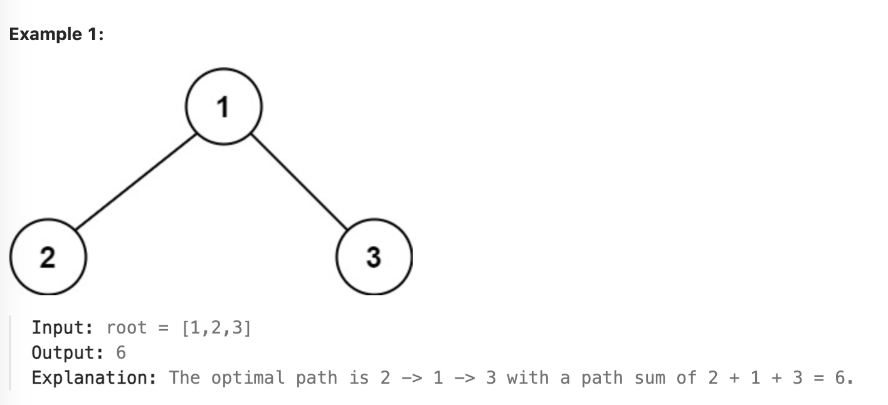
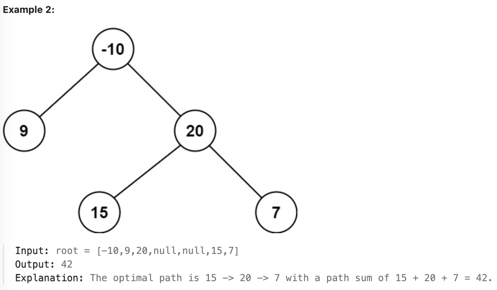

# leetcode - hard
# 124 Maximum path sum
A path in a binary tree is a sequence of nodes where each pair of adjacent nodes in the sequence has an edge connecting them. A node can only appear in the sequence at most once. **Note that the path does not need to pass through the root.**

The path sum of a path is the sum of the node's values in the path.

Given the root of a binary tree, return the maximum path sum of any non-empty path.

## Example

## Constraints
* The number of nodes in the tree is in the range [1, 3 * 104].
* -1000 <= Node.val <= 1000